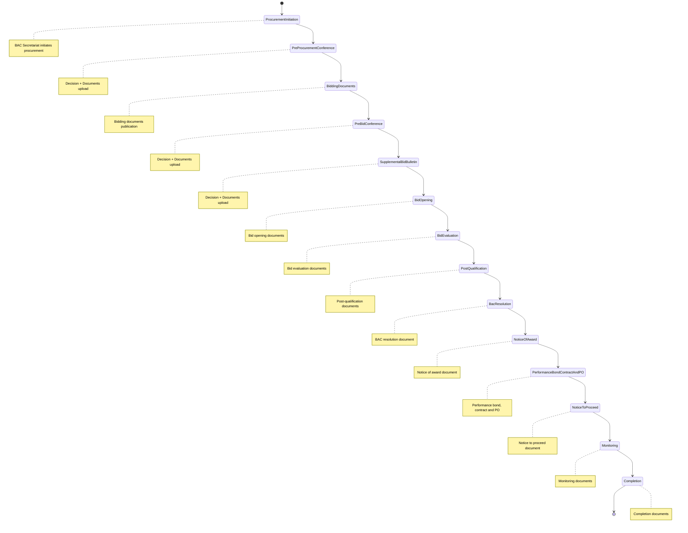
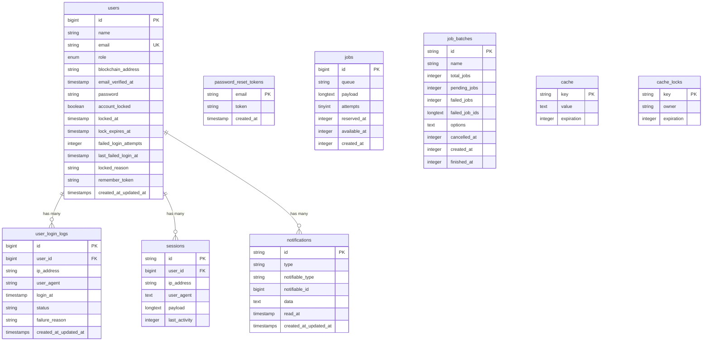
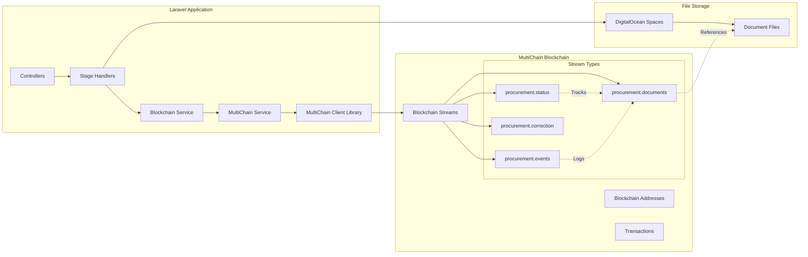

# ProcuChain Architecture Diagram

This document contains a comprehensive Mermaid diagram visualizing the entire ProcuChain codebase architecture.

## Full System Architecture

```mermaid
graph TB
    %% Frontend Layer
    subgraph "Frontend Layer (React/TypeScript/Inertia.js)"
        UI[User Interface]
        subgraph "Pages"
            HOME[Home Page]
            AUTH[Authentication Pages]
            DASH_BAC[BAC Secretariat Dashboard]
            DASH_CHAIR[BAC Chairman Dashboard]
            DASH_HOPE[HOPE Dashboard]
            DASH_ADMIN[Admin Dashboard]
            PROC_LIST[Procurements List]
            PROC_DETAIL[Procurement Details]
            USER_MGMT[User Management]
            SEARCH[Search Interface]
            SETTINGS[Settings Pages]
        end
        
        subgraph "Components & Layouts"
            COMP[Reusable Components]
            LAYOUT[Layout Components]
            FORMS[Form Components]
        end
    end

    %% Middleware Layer
    subgraph "Middleware Layer"
        AUTH_MW[Authentication Middleware]
        ROLE_MW[Role-based Access Control]
        INERTIA_MW[Inertia Request Handler]
        APPEAR_MW[Appearance Handler]
    end

    %% Controller Layer
    subgraph "Controller Layer"
        subgraph "Main Controllers"
            BAC_SEC_CTRL[BacSecretariatController]
            BAC_CHAIR_CTRL[BacChairmanController]
            HOPE_CTRL[HopeController]
            ADMIN_CTRL[AdminController]
            PROC_CTRL[ProcurementController]
            VIEW_CTRL[ViewProcurementsController]
            AUTH_CTRL[AuthenticatedSessionController]
            SEARCH_CTRL[SearchController]
            NOTIF_CTRL[NotificationController]
            SECURE_CTRL[SecureFileController]
        end
    end

    %% Request Validation Layer
    subgraph "Request Validation"
        PROC_REQ[Procurement Requests]
        AUTH_REQ[Authentication Requests]
        USER_REQ[User Management Requests]
    end

    %% Service Layer
    subgraph "Service Layer"
        PROC_SVC[ProcurementServices]
        MULTI_SVC[MultichainService]
        BLOCKCHAIN_SVC[BlockchainService]
        FILE_SVC[FileStorageService]
        NOTIF_SVC[NotificationService]
        STREAM_SVC[StreamKeyService]
        LOGIN_SVC[LoginTrackingService]
        TRANSITION_SVC[ProcurementStageTransitionService]
        EVENT_MAPPER[EventTypeLabelMapper]
    end

    %% Handler Layer
    subgraph "Procurement Stage Handlers"
        BASE_HANDLER[BaseStageHandler]
        
        subgraph "Stage Handlers"
            INIT_HANDLER[ProcurementInitiationHandler]
            PRE_PROC_HANDLER[PreProcurementConferenceHandlers]
            BID_DOC_HANDLER[BiddingDocumentsHandler]
            PRE_BID_HANDLER[PreBidConferenceHandlers]
            SUPP_BID_HANDLER[SupplementalBidBulletinHandlers]
            BID_OPEN_HANDLER[BidOpeningDocumentsHandler]
            BID_EVAL_HANDLER[BidEvaluationDocumentsHandler]
            POST_QUAL_HANDLER[PostQualificationDocumentsHandler]
            BAC_RES_HANDLER[BacResolutionDocumentHandler]
            NOA_HANDLER[NoticeOfAwardDocumentHandler]
            PERF_BOND_HANDLER[PerformanceBondContractAndPoHandler]
            NTP_HANDLER[NoticeToProceedDocumentHandler]
            MON_HANDLER[MonitoringDocumentHandler]
            COMP_HANDLER[CompletionDocumentsHandler]
        end
    end

    %% Model Layer
    subgraph "Model Layer"
        USER_MODEL[User Model]
        LOGIN_LOG_MODEL[UserLoginLog Model]
    end

    %% Enums
    subgraph "Enums"
        STAGE_ENUM[StageEnums]
        STATUS_ENUM[StatusEnums]
        STREAM_ENUM[StreamEnums]
        ROLE_ENUM[UserRoleEnums]
    end

    %% External Services
    subgraph "External Services"
        MULTICHAIN[MultiChain Blockchain]
        SPACES[DigitalOcean Spaces]
        MAIL[Mail Service]
        CACHE[Cache Service]
        DATABASE[(MySQL Database)]
    end

    %% Routing
    subgraph "Routing"
        WEB_ROUTES[Web Routes]
        AUTH_ROUTES[Auth Routes]
        SETTINGS_ROUTES[Settings Routes]
    end

    %% Configuration
    subgraph "Configuration"
        APP_CONFIG[App Configuration]
        DB_CONFIG[Database Configuration]
        BLOCKCHAIN_CONFIG[MultiChain Configuration]
        MAIL_CONFIG[Mail Configuration]
        CACHE_CONFIG[Cache Configuration]
    end

    %% Data Flow Connections
    UI --> AUTH_MW
    AUTH_MW --> ROLE_MW
    ROLE_MW --> INERTIA_MW
    INERTIA_MW --> WEB_ROUTES
    
    WEB_ROUTES --> BAC_SEC_CTRL
    WEB_ROUTES --> BAC_CHAIR_CTRL
    WEB_ROUTES --> HOPE_CTRL
    WEB_ROUTES --> ADMIN_CTRL
    WEB_ROUTES --> PROC_CTRL
    WEB_ROUTES --> VIEW_CTRL
    WEB_ROUTES --> SEARCH_CTRL
    WEB_ROUTES --> NOTIF_CTRL
    WEB_ROUTES --> SECURE_CTRL
    
    BAC_SEC_CTRL --> PROC_SVC
    BAC_CHAIR_CTRL --> PROC_SVC
    HOPE_CTRL --> PROC_SVC
    ADMIN_CTRL --> PROC_SVC
    ADMIN_CTRL --> LOGIN_SVC
    PROC_CTRL --> PROC_REQ
    PROC_CTRL --> INIT_HANDLER
    PROC_CTRL --> PRE_PROC_HANDLER
    PROC_CTRL --> BID_DOC_HANDLER
    PROC_CTRL --> PRE_BID_HANDLER
    PROC_CTRL --> SUPP_BID_HANDLER
    PROC_CTRL --> BID_OPEN_HANDLER
    PROC_CTRL --> BID_EVAL_HANDLER
    PROC_CTRL --> POST_QUAL_HANDLER
    PROC_CTRL --> BAC_RES_HANDLER
    PROC_CTRL --> NOA_HANDLER
    PROC_CTRL --> PERF_BOND_HANDLER
    PROC_CTRL --> NTP_HANDLER
    PROC_CTRL --> MON_HANDLER
    PROC_CTRL --> COMP_HANDLER
    
    VIEW_CTRL --> PROC_SVC
    SECURE_CTRL --> PROC_SVC
    
    PROC_SVC --> MULTI_SVC
    PROC_SVC --> STREAM_SVC
    PROC_SVC --> TRANSITION_SVC
    PROC_SVC --> EVENT_MAPPER
    
    BASE_HANDLER --> BLOCKCHAIN_SVC
    BASE_HANDLER --> FILE_SVC
    BASE_HANDLER --> NOTIF_SVC
    
    INIT_HANDLER --> BASE_HANDLER
    PRE_PROC_HANDLER --> BASE_HANDLER
    BID_DOC_HANDLER --> BASE_HANDLER
    PRE_BID_HANDLER --> BASE_HANDLER
    SUPP_BID_HANDLER --> BASE_HANDLER
    BID_OPEN_HANDLER --> BASE_HANDLER
    BID_EVAL_HANDLER --> BASE_HANDLER
    POST_QUAL_HANDLER --> BASE_HANDLER
    BAC_RES_HANDLER --> BASE_HANDLER
    NOA_HANDLER --> BASE_HANDLER
    PERF_BOND_HANDLER --> BASE_HANDLER
    NTP_HANDLER --> BASE_HANDLER
    MON_HANDLER --> BASE_HANDLER
    COMP_HANDLER --> BASE_HANDLER
    
    BLOCKCHAIN_SVC --> MULTI_SVC
    BLOCKCHAIN_SVC --> STREAM_SVC
    
    MULTI_SVC --> MULTICHAIN
    FILE_SVC --> SPACES
    NOTIF_SVC --> MAIL
    
    BAC_SEC_CTRL --> USER_MODEL
    BAC_CHAIR_CTRL --> USER_MODEL
    HOPE_CTRL --> USER_MODEL
    ADMIN_CTRL --> USER_MODEL
    ADMIN_CTRL --> LOGIN_LOG_MODEL
    LOGIN_SVC --> LOGIN_LOG_MODEL
    
    USER_MODEL --> DATABASE
    LOGIN_LOG_MODEL --> DATABASE
    
    %% Configuration connections
    MULTI_SVC --> BLOCKCHAIN_CONFIG
    DATABASE --> DB_CONFIG
    MAIL --> MAIL_CONFIG
    CACHE --> CACHE_CONFIG
    
    %% Enum usage
    PROC_CTRL --> STAGE_ENUM
    PROC_CTRL --> STATUS_ENUM
    PROC_SVC --> STREAM_ENUM
    ROLE_MW --> ROLE_ENUM
    
    %% Styling
    classDef frontend fill:#e1f5fe,stroke:#01579b,stroke-width:2px
    classDef controller fill:#f3e5f5,stroke:#4a148c,stroke-width:2px
    classDef service fill:#e8f5e8,stroke:#1b5e20,stroke-width:2px
    classDef handler fill:#fff3e0,stroke:#e65100,stroke-width:2px
    classDef model fill:#fce4ec,stroke:#880e4f,stroke-width:2px
    classDef external fill:#f1f8e9,stroke:#33691e,stroke-width:2px
    classDef config fill:#e0f2f1,stroke:#00695c,stroke-width:2px
    
    class UI,HOME,AUTH,DASH_BAC,DASH_CHAIR,DASH_HOPE,DASH_ADMIN,PROC_LIST,PROC_DETAIL,USER_MGMT,SEARCH,SETTINGS,COMP,LAYOUT,FORMS frontend
    class BAC_SEC_CTRL,BAC_CHAIR_CTRL,HOPE_CTRL,ADMIN_CTRL,PROC_CTRL,VIEW_CTRL,AUTH_CTRL,SEARCH_CTRL,NOTIF_CTRL,SECURE_CTRL controller
    class PROC_SVC,MULTI_SVC,BLOCKCHAIN_SVC,FILE_SVC,NOTIF_SVC,STREAM_SVC,LOGIN_SVC,TRANSITION_SVC,EVENT_MAPPER service
    class BASE_HANDLER,INIT_HANDLER,PRE_PROC_HANDLER,BID_DOC_HANDLER,PRE_BID_HANDLER,SUPP_BID_HANDLER,BID_OPEN_HANDLER,BID_EVAL_HANDLER,POST_QUAL_HANDLER,BAC_RES_HANDLER,NOA_HANDLER,PERF_BOND_HANDLER,NTP_HANDLER,MON_HANDLER,COMP_HANDLER handler
    class USER_MODEL,LOGIN_LOG_MODEL model
    class MULTICHAIN,SPACES,MAIL,CACHE,DATABASE external
    class APP_CONFIG,DB_CONFIG,BLOCKCHAIN_CONFIG,MAIL_CONFIG,CACHE_CONFIG config
```

## Procurement Workflow State Machine

## User Roles and Permissions

```mermaid
graph TD
    subgraph "User Roles"
        ADMIN[Admin]
        BAC_SEC[BAC Secretariat]
        BAC_CHAIR[BAC Chairman]
        HOPE[HOPE - Head of Procuring Entity]
    end
    
    subgraph "Admin Permissions"
        ADMIN_DASH[Dashboard Access]
        USER_MGMT_PERM[User Management]
        LOGIN_TRACK[Login Tracking]
        FULL_PROC_VIEW[Full Procurement View]
        SYSTEM_ADMIN[System Administration]
    end
    
    subgraph "BAC Secretariat Permissions"
        BAC_SEC_DASH[Dashboard Access]
        PROC_INIT[Procurement Initiation]
        DOC_UPLOAD[Document Upload]
        STAGE_TRANS[Stage Transitions]
        PROC_MGMT[Procurement Management]
    end
    
    subgraph "BAC Chairman Permissions"
        BAC_CHAIR_DASH[Dashboard Access]
        PROC_VIEW[Procurement Viewing]
        OVERSIGHT[Oversight Functions]
    end
    
    subgraph "HOPE Permissions"
        HOPE_DASH[Dashboard Access]
        PROC_MONITOR[Procurement Monitoring]
        APPROVAL[Approval Functions]
    end
    
    ADMIN --> ADMIN_DASH
    ADMIN --> USER_MGMT_PERM
    ADMIN --> LOGIN_TRACK
    ADMIN --> FULL_PROC_VIEW
    ADMIN --> SYSTEM_ADMIN
    
    BAC_SEC --> BAC_SEC_DASH
    BAC_SEC --> PROC_INIT
    BAC_SEC --> DOC_UPLOAD
    BAC_SEC --> STAGE_TRANS
    BAC_SEC --> PROC_MGMT
    
    BAC_CHAIR --> BAC_CHAIR_DASH
    BAC_CHAIR --> PROC_VIEW
    BAC_CHAIR --> OVERSIGHT
    
    HOPE --> HOPE_DASH
    HOPE --> PROC_MONITOR
    HOPE --> APPROVAL
```

## Database Entity Relationship Diagram

## Blockchain Integration Architecture

## Key Features

### 1. **Role-Based Access Control**
- 4 distinct user roles with specific permissions
- Middleware-enforced access control
- Role-specific dashboards and functionality

### 2. **Blockchain Integration**
- MultiChain blockchain for document integrity
- Multiple streams for different data types
- Immutable audit trail

### 3. **Document Management**
- Secure file storage in DigitalOcean Spaces
- Stage-specific document handlers
- File validation and security

### 4. **Procurement Workflow**
- 14-stage procurement process
- State machine-driven transitions
- Automated notifications

### 5. **Security Features**
- Account locking mechanism
- Login attempt tracking
- Secure file downloads
- Blockchain address validation

### 6. **Caching Strategy**
- Dashboard data caching
- User name caching
- Performance optimization

### 7. **Search and Notifications**
- Full-text search capability
- Real-time notifications
- Activity tracking

This architecture represents a comprehensive blockchain-powered procurement management system with strong separation of concerns, security features, and scalable design patterns.
