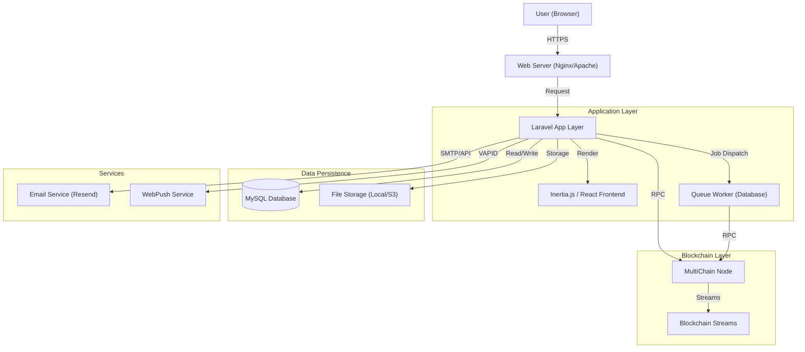

# ProcuChain System Architecture

This document provides a high-level overview of the ProcuChain system architecture. For detailed architecture of specific subsystems, please refer to the following:

- [Reporting Architecture](REPORTING_ARCHITECTURE.md)
- [Database Schema](DATABASE_SCHEMA.md)
- [Routes/API Reference](ROUTES.md)

## High-Level Architecture

ProcuChain follows a layered architecture, integrating a standard web application stack with a private blockchain network for data immutability and auditability.

## Core Components

### 1. Web/API Layer (Laravel 12 + Inertia)
- **Framework**: Laravel 12 serves as the core backend framework.
- **Frontend**: Inertia.js with React 19 acts as the "glue" between backend and frontend, allowing for a modern SPA experience without the complexity of a separate API.
- **Authentication**: Laravel Fortify handles authentication flows (Login, 2FA).
- **Authorization**: Spatie Permission handles role-based access control (Admin, BAC Secretariat, BAC Chairman, HOPE).

### 2. Blockchain Layer (MultiChain)
- **Role**: Provides an immutable ledger for procurement activities.
- **Streams**: Data is organized into independent "streams" (key-value databases on the chain).
    - `procurement.metadata`: Core procurement info.
    - `procurement.documents`: Document hashes and metadata.
    - `procurement.status`: Workflow state transitions.
    - `procurement.events`: Audit logs.
    - `procurement.corrections`: Correction history.
    - `file.data` & `file.metadata`: On-chain file storage.
- **Smart Filters**: JavaScript-based validation rules running on the blockchain node ensure data integrity before writes are accepted.

### 3. Asynchronous Processing
- **Queue**: Database-driven queue system handles time-consuming tasks to keep the UI responsive.
    - Blockchain writes (publishing documents).
    - Email notifications.
    - File processing.

### 4. Data Flow

#### Document Upload Flow
1. User uploads file via React Frontend.
2. Controller receives file, validates MIME type and size.
3. File is temporarily stored in local storage.
4. **Job Dispatched**: A generic "Publish to Blockchain" job is queued.
    - Calculates SHA-256 hash.
    - Writes file content to `file.data` stream (if configured for on-chain storage).
    - Writes metadata to `file.metadata` stream.
    - Writes reference to `procurement.documents` stream.
5. User is notified via WebPush/Email upon success.

#### Workflow Transition Flow
1. User triggers a stage completion (e.g., "Finish Bidding").
2. Controller validates requirements (e.g., are all required documents uploaded?).
3. **Transaction**: New status written to `procurement.status` stream on blockchain.
4. `procurement_workflow_configs` and `stage_document_configs` tables define the rules for transitions.

## Directory Structure

- `app/Http/Controllers`: Request handling.
- `app/Services`: Business logic isolation (e.g., `BlockchainService`, `ReportGenerationService`).
- `app/Models`: Eloquent ORM models.
- `resources/js`: React frontend application.
- `resources/blockchain/filters`: Smart logic for MultiChain stream validation.
- `routes`: Application route definitions.
- `database/migrations`: Database schema definitions.
- `docs`: Project documentation.
