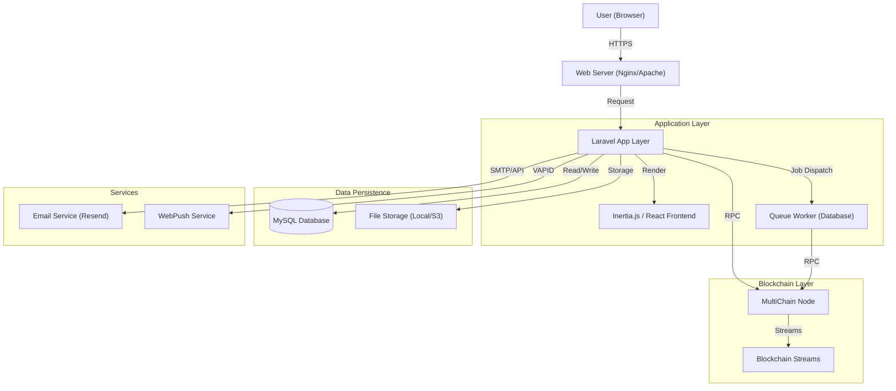
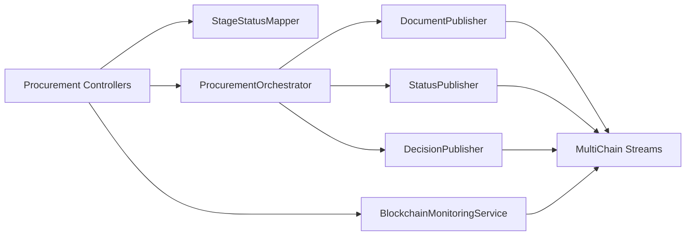

# ProcuChain System Architecture

This document provides a high-level overview of the ProcuChain system architecture. For detailed architecture of specific subsystems, please refer to the following:

- [Reporting Architecture](REPORTING_ARCHITECTURE.md)
- [Database Schema](DATABASE_SCHEMA.md)
- [Routes/API Reference](ROUTES.md)

## High-Level Architecture

ProcuChain follows a layered architecture, integrating a standard web application stack with a private blockchain network for data immutability and auditability.

## Core Components

### 1. Web/API Layer (Laravel 12 + Inertia)

- **Framework**: Laravel 12 serves as the core backend framework.
- **Frontend**: Inertia.js with React 19 acts as the "glue" between backend and frontend, allowing for a modern SPA experience without the complexity of a separate API.
- **Authentication**: Laravel Fortify handles authentication flows (Login, 2FA).
- **Authorization**: Spatie Permission handles role-based access control (Admin, BAC Secretariat, BAC Chairman, HOPE).

### 2. Blockchain Layer (MultiChain)

- **Role**: Provides an immutable ledger for procurement activities.
- **Streams**: Data is organized into independent "streams" (key-value databases on the chain).
    - `procurement.metadata`: Core procurement info.
    - `procurement.documents`: Document hashes and metadata.
    - `procurement.status`: Workflow state transitions.
    - `procurement.events`: Audit logs.
    - `procurement.corrections`: Correction history.
    - `file.data` & `file.metadata`: On-chain file storage.
- **Smart Filters**: JavaScript-based validation rules running on the blockchain node ensure data integrity before writes are accepted.

### 3. Service Layer Architecture

- **Role**: Business logic isolation to maintain clean controllers and reusable components. The service layer is designed to be modular, following the Single Responsibility Principle.

- **Core Services**:
    - `StageStatusMapper`: The single source of truth for mapping procurement stages to their corresponding initial, ongoing, and completion statuses. This centralizes logic that was previously fragmented across multiple traits and controllers.
    - `DecisionPublisher`: Consolidates the logic for publishing conference (Pre-Procurement, Pre-Bid) and bulletin decisions to the blockchain. It handles both "held" (awaiting documents) and "skipped" (immediate transition to next stage) scenarios with consistent event logging.
    - `BlockchainMonitoringService`: Provides real-time health checks for the blockchain connection. It implements a **Circuit Breaker Pattern** (CLOSED, OPEN, HALF-OPEN states) to prevent system hammering when the blockchain node is unreachable, allowing for automated recovery detection.
    - `ProcurementOrchestrator`: Coordinates complex multi-step operations involving both database and blockchain writes.
    - `DocumentPublisher` & `StatusPublisher`: Specialized services for writing specific data types to MultiChain streams.

### 4. Reporting Module Architecture

The reporting module provides high-level analytics and document generation capabilities, leveraging a hybrid data retrieval strategy.

- **Components**:
    - `ReportController`: Handles HTTP requests for report generation, exporting (PDF/CSV/JSON), and semantic searching.
    - `ReportGenerationService`: Manages the report generation lifecycle, including parameter processing, data aggregation, and time-series data generation for visualizations.
    - `SemanticSearchService`: Provides advanced search capabilities across procurement data. It performs filtered searches and calculates aggregated statistics (counts by status, stage, mode, etc.).
- **Data Retrieval**: It primarily interacts with `ProcurementDataService` to fetch and process on-chain data, which is then filtered and aggregated in-memory for performance.

### 5. Request & Validation Architecture

- **Base Architecture**: Standardized validation using specialized Form Request classes.
- **BaseProcurementRequest**: An abstract base class that enforces:
    - **Authorization**: Ensures only users with the `BAC_SECRETARIAT` role can perform procurement actions.
    - **Shared Rules**: Common validation for `pr_number` and `procurement_title`.
    - **Helper Methods**: Standardized rules for single (`documentRules()`) and multiple (`multipleDocumentRules()`) PDF uploads.
- **Reusable Traits**:
    - `HasConferenceValidation`: Shared validation logic for conference-related documents, including minutes, attendance files, meeting dates, and participant lists.

### 6. Asynchronous Processing

- **Queue**: Database-driven queue system handles time-consuming tasks to keep the UI responsive.
    - Blockchain writes (publishing documents).
    - Email notifications.
    - File processing.

### 7. Data Flow

#### Document Upload Flow

1. User uploads file via React Frontend.
2. Controller receives file, validates MIME type and size.
3. File is temporarily stored in local storage.
4. **Job Dispatched**: A generic "Publish to Blockchain" job is queued.
    - Calculates SHA-256 hash.
    - Writes file content to `file.data` stream (if configured for on-chain storage).
    - Writes metadata to `file.metadata` stream.
    - Writes reference to `procurement.documents` stream.
5. User is notified via WebPush/Email upon success.

#### Workflow Transition Flow

1. User triggers a stage completion (e.g., "Finish Bidding").
2. Controller validates requirements (e.g., are all required documents uploaded?).
3. **Transaction**: New status written to `procurement.status` stream on blockchain.
4. `procurement_workflow_configs` and `stage_document_configs` tables define the rules for transitions.

## Directory Structure

- `app/Http/Requests/Procurement`: Specialized Form Request classes.
- `app/Http/Requests/Procurement/Traits`: Reusable validation traits (e.g., `HasConferenceValidation`).
- `app/Services/Procurement`: Procurement-specific business logic (e.g., `StageStatusMapper`).
- `app/Services/Publishers`: Blockchain publishing services (e.g., `DecisionPublisher`, `DocumentPublisher`).
- `app/Http/Controllers`: Request handling.
- `app/Services`: Business logic isolation (e.g., `BlockchainService`, `ReportGenerationService`).
- `app/Models`: Eloquent ORM models.
- `resources/js`: React frontend application.
- `resources/blockchain/filters`: Smart logic for MultiChain stream validation.
- `routes`: Application route definitions.
- `database/migrations`: Database schema definitions.
- `docs`: Project documentation.
