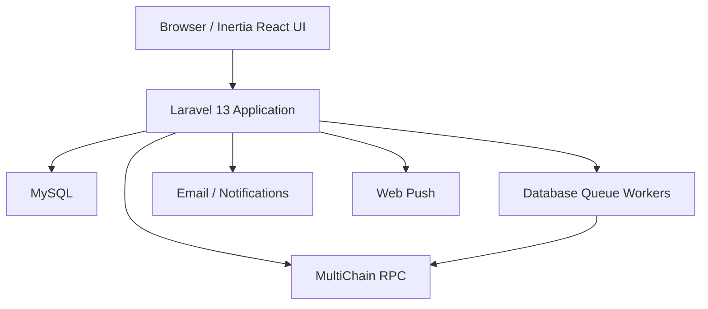
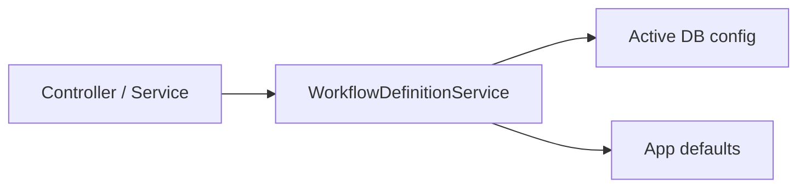

# ProcuChain Architecture

This document describes the current runtime architecture of ProcuChain after the workflow-definition consolidation and stage-flow refactors.

Related documents:

- [Quick Start](QUICK_START.md)
- [Route Reference](ROUTES.md)
- [Blockchain Schema](BLOCKCHAIN_SCHEMA.md)
- [Database Schema](DATABASE_SCHEMA.md)
- [Reporting Subsystem](REPORTING_ARCHITECTURE.md)

## System Overview



The application uses MySQL for mutable operational state and MultiChain for immutable procurement records and file integrity data.

## Core Runtime Layers

### Web Layer

- `routes/web.php`, `routes/auth.php`, and `routes/settings.php` define the route surface.
- Inertia pages live under `resources/js/pages`.
- Controllers stay thin and delegate to services for workflow, publishing, reporting, dashboard assembly, and admin operations.

### Application Services

The current backend centers around a service-oriented architecture:

- `WorkflowDefinitionService` is the runtime source of truth for workflow stages, optional stages, required documents, optional documents, and stage document guides.
- `ProcurementWorkflowService` and `StageDocumentConfigService` now delegate workflow/document rule lookups through `WorkflowDefinitionService`.
- procurement stage controllers delegate command-heavy behavior into focused procurement services rather than carrying the full transition logic inline.
- publishers and repositories isolate MultiChain stream writes and reads.

### Persistence Split

MySQL stores:

- users, roles, permissions
- sessions, cache, jobs, failed jobs
- workflow configuration tables
- notifications and push subscriptions
- invitations, login logs, blocked IPs, audit records

MultiChain stores:

- procurement metadata
- procurement documents
- procurement status history
- procurement events
- correction streams
- archive flags
- file content and metadata

## Workflow Definition Resolution

Workflow/document rules are now resolved in one place.



Resolution order:

1. `procurement_workflow_configs`
2. `stage_document_configs`
3. enum- and service-backed defaults

This preserves admin overrides while keeping fallback behavior intact when no row exists.

## Procurement Flow

The procurement workflow is split across role-specific views and write endpoints.

Typical document upload/completion flow:

1. BAC Secretariat opens a stage page through an Inertia route.
2. Controller gathers procurement details, stage rules, and document requirements.
3. Validation runs through form requests and workflow/document services.
4. Write actions dispatch blockchain publishing or transition work.
5. Publishers and repositories persist immutable records to the relevant streams.
6. Dashboard/list/report services read stream data back through higher-level services.

## File Storage Model

Files are stored on-chain.

- `file.data` stores raw file payloads for small files.
- `file.chunks` stores chunked payloads and chunk metadata for large files.
- `file.metadata` stores file metadata, hash, storage method, and retrieval references.
- `procurement.documents` stores procurement-facing document records that point to the file storage layer.

The canonical file key format is generated by `App\Services\Blockchain\FileUploader` and includes procurement number, phase, stage, document type, timestamp, and hash fragment.

## Security Model

Security controls are layered:

- Laravel Fortify authentication and password reset flows
- two-factor authentication settings
- Spatie roles and permissions
- account lockout and blocked IP tooling
- CSP and standard security headers through `SecurityHeaders`
- explicit shared Inertia auth payloads through `HandleInertiaRequests`
- immutable blockchain audit data for status, document, and event history

## Dashboard, Reporting, and Search

- dashboards aggregate procurement data per role and handle degraded blockchain availability more safely than before
- reporting is provided by `ReportController`, `ReportGenerationService`, `SemanticSearchService`, and `ProcurementDataService`
- the current "semantic search" feature is a filtered keyword search subsystem, not an embeddings/vector retrieval stack

## Frontend Structure

Frontend code is organized around:

- `resources/js/pages` for route-bound Inertia pages
- extracted feature components for large pages such as stage upload and blockchain explorer
- generated Wayfinder route/action helpers
- typed shared auth payloads aligned with backend middleware

Do not hand-edit generated files under:

- `resources/js/routes`
- `resources/js/actions`
- `resources/js/wayfinder`

## Operational Commands

Important commands tied to the current architecture:

```bash
php artisan multichain:setup --check --no-interaction
php artisan multichain:setup --no-interaction
php artisan workflow:sync-defaults --no-interaction
php artisan route:list --json --no-interaction
```

## Current Architectural Boundaries

Use these boundaries when extending the application:

- keep controllers thin
- route workflow/document lookups through `WorkflowDefinitionService`
- write blockchain records through publishers/repositories, not ad hoc controller RPC calls
- treat MySQL as operational state and MultiChain as immutable procurement state
- preserve named routes and Wayfinder generation flow when changing route-backed UI behavior
