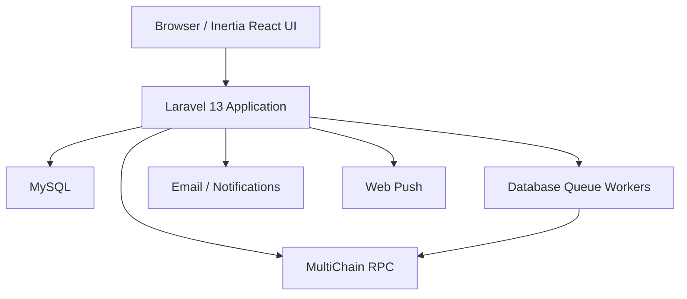
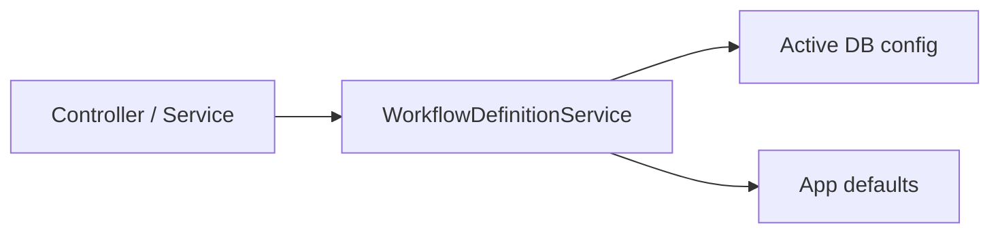
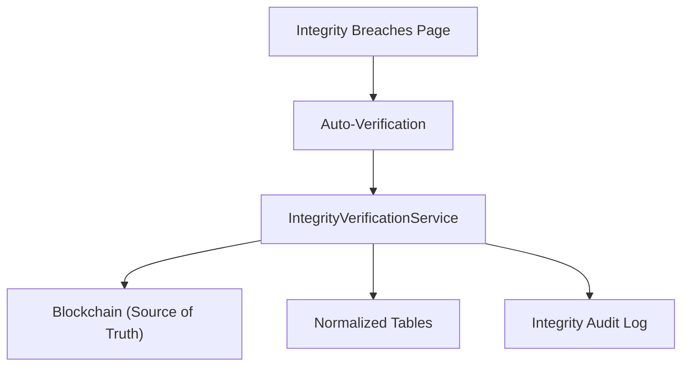

# ProcuChain Architecture

This document describes the current runtime architecture of ProcuChain.

Related documents:

- [Quick Start](QUICK_START.md)
- [Route Reference](ROUTES.md)
- [Blockchain Schema](BLOCKCHAIN_SCHEMA.md)
- [Database Schema](DATABASE_SCHEMA.md)
- [Reporting Subsystem](REPORTING_ARCHITECTURE.md)

## System Overview



The application uses MySQL for mutable operational state and MultiChain for immutable procurement records and file integrity data.

**Key Design Principle:** MultiChain nodes auto-sync across all nodes. Data is never permanently lost — it's replicated across the full mesh.

## Core Runtime Layers

### Web Layer

- `routes/web.php` loads the route surface from `routes/web/*.php` plus `routes/auth.php` and `routes/settings.php`.
- Inertia pages live under `resources/js/pages`.
- Controllers stay thin and delegate to services for workflow, publishing, reporting, dashboard assembly, and admin operations.

### Application Services

The backend uses a service-oriented architecture:

- **WorkflowDefinitionService** — Runtime source of truth for workflow stages, optional stages, required documents, optional documents, and stage document guides.
- **IntegrityVerificationService** — Verifies normalized DB tables against blockchain (source of truth). Runs automatically when the Integrity Breaches page loads.
- **BlockchainRecordSyncService** — Syncs data between blockchain and normalized MySQL tables.
- **FileUploader / FileRetriever / FileLifecycleManager** — Handle file storage operations on blockchain.
- **Publishers** — Isolate MultiChain stream writes.
- **Repositories** — Isolate MultiChain stream reads.

### Persistence Split

**MySQL stores:**
- users, roles, permissions
- sessions, cache, jobs, failed jobs
- workflow configuration tables
- notifications and push subscriptions
- invitations, login logs, blocked IPs, audit records
- Normalized procurement tables (query cache)

**MultiChain stores:**
- procurement metadata
- procurement documents
- procurement status history
- procurement events
- correction streams
- archive flags
- file content and metadata
- Integrity audit trail (append-only)

## Workflow Definition Resolution

Workflow/document rules are resolved in one place:



Resolution order:
1. `procurement_workflow_configs`
2. `stage_document_configs`
3. Enum- and service-backed defaults

This preserves admin overrides while keeping fallback behavior intact when no row exists.

## Procurement Flow

Typical document upload/completion flow:

1. BAC Secretariat opens a stage page through an Inertia route.
2. Controller gathers procurement details, stage rules, and document requirements.
3. Validation runs through form requests and workflow/document services.
4. Write actions dispatch blockchain publishing or transition work.
5. Publishers and repositories persist immutable records to the relevant streams.
6. Dashboard/list/report services read stream data back through higher-level services.

## File Storage Model

Files are stored on-chain:

| Stream | Purpose |
|--------|---------|
| `file.data` | Raw file payloads for small files |
| `file.chunks` | Chunked payloads and chunk metadata for large files |
| `file.metadata` | File metadata, hash, storage method, and retrieval references |
| `procurement.documents` | Procurement-facing document records pointing to file storage |

The canonical file key format is generated by `App\Services\Blockchain\FileUploader` and includes procurement number, phase, stage, document type, timestamp, and hash fragment.

## Integrity Verification System

The integrity system ensures data consistency between MySQL and blockchain:



**Automatic Verification:** When the Integrity Breaches page loads, verification runs automatically in the background. No manual "Run Verification" button is needed.

**Breach Detection Layers:**
1. **Layer 1:** data_hash check — Was record modified since sync?
2. **Layer 2:** Field-level diff — What specifically changed?
3. **Layer 3:** Content comparison against chain — Authoritative check
4. **Layer 4:** Row existence check — Detects deletions

**Breach Types:**
- `unauthorized_modification` — Record modified outside blockchain
- `row_deleted` — Record exists on chain but missing from DB
- `hash_mismatch` — Data hash doesn't match blockchain record

## Security Model

Security controls are layered:

- Laravel Fortify authentication and password reset flows
- Two-factor authentication settings
- Spatie roles and permissions
- Account lockout and blocked IP tooling
- CSP and standard security headers through `SecurityHeaders`
- Explicit shared Inertia auth payloads through `HandleInertiaRequests`
- Immutable blockchain audit data for status, document, and event history

**Error Handling:** All controller catch blocks use `report($e)` to ensure exceptions are sent to Sentry for monitoring.

## Dashboard, Reporting, and Search

- Dashboards aggregate procurement data per role and handle degraded blockchain availability
- Reporting is provided by `ReportController`, `ReportGenerationService`, `ProcurementSearchService`, and `ProcurementDataService`
- `SemanticSearchService` is a filtered keyword search subsystem (not embeddings/vector)

## Frontend Structure

Frontend code is organized around:

- `resources/js/pages` — Route-bound Inertia pages
- `resources/js/components` — Reusable UI components (shadcn/ui)
- `resources/js/routes` — Generated Wayfinder route helpers (do not edit)
- `resources/js/actions` — Generated Wayfinder action helpers (do not edit)

**Generated Files (do not hand-edit):**
- `resources/js/routes`
- `resources/js/actions`
- `resources/js/wayfinder`

To regenerate after route changes:
```bash
php artisan wayfinder:generate
```

## Operational Commands

```bash
# Check MultiChain setup
php artisan multichain:setup --check --no-interaction

# Sync workflow defaults
php artisan workflow:sync-defaults --no-interaction

# List routes
php artisan route:list --json --no-interaction

# Run integrity verification manually
php artisan integrity:verify

# Sync normalized tables
php artisan blockchain:sync-normalized
```

## Architectural Boundaries

When extending the application:

1. **Keep controllers thin** — Delegate to services
2. **Route workflow/document lookups** through `WorkflowDefinitionService`
3. **Write blockchain records** through publishers/repositories, not ad hoc controller RPC calls
4. **Treat MySQL as operational state** and **MultiChain as immutable procurement state**
5. **Preserve named routes** and Wayfinder generation flow when changing route-backed UI behavior
6. **All catch blocks** must include `report($e)` for Sentry monitoring
