# Procurement Workflow Documentation

## Table of Contents

- [Overview](#overview)
- [Workflow Diagram](#workflow-diagram)
- [Workflow Stages](#workflow-stages)
- [Decision Dialogs](#decision-dialogs)
- [Auto-Transitions](#auto-transitions)
- [Blockchain Integration](#blockchain-integration)
- [Frontend Action Registry](#frontend-action-registry)
- [Upload Pages](#upload-pages)
- [Workflow Validation](#workflow-validation)
- [Error Handling](#error-handling)
- [Testing](#testing)
- [Compliance](#compliance)
- [Future Enhancements](#future-enhancements)
- [Related Documentation](#related-documentation)

---

## Overview

This document describes the complete procurement workflow implemented in the ProcuChain system, from initiation to completion. The workflow follows Philippine Republic Act 9184 (Government Procurement Reform Act) requirements and maintains a blockchain audit trail for transparency.

The procurement process consists of **15 stages** organized into three major phases:

| Phase | Stages | Controller |
|-------|--------|------------|
| **Phase 1: Pre-Procurement** | Stages 1-3 | `PreProcurementController` |
| **Phase 2: Procurement** | Stages 4-9 | `ProcurementController` |
| **Phase 3: Post-Procurement** | Stages 10-15 | `PostProcurementController` |

---

## Workflow Diagram

```mermaid
%%{init: {'theme':'base', 'themeVariables': { 'primaryColor':'#e3f2fd','primaryTextColor':'#1a237e','primaryBorderColor':'#1976d2','lineColor':'#424242','secondaryColor':'#fff9c4','tertiaryColor':'#c8e6c9','noteBkgColor':'#fff3e0','noteTextColor':'#e65100','noteBorderColor':'#ff6f00'}}}%%
flowchart TD
    Start([Procurement Initiation]) --> Decision1{Pre-Procurement<br/>Conference?}
    
    Decision1 -->|Yes| PreProc[Pre-Procurement<br/>Conference]
    Decision1 -->|No| BidDocs[Bidding Documents]
    PreProc --> BidDocs
    
    BidDocs -->|Auto-Transition| Decision2{Pre-Bid<br/>Conference?}
    
    Decision2 -->|Yes| PreBid[Pre-Bid Conference]
    Decision2 -->|No| Decision3{Supplemental<br/>Bid Bulletin?}
    PreBid -->|Auto-Transition| Decision3
    
    Decision3 -->|Yes| SuppBid[Supplemental<br/>Bid Bulletin]
    Decision3 -->|No| BidOpen[Bid Opening]
    SuppBid --> BidOpen
    
    BidOpen --> BidEval[Bid Evaluation]
    BidEval --> PostQual[Post-Qualification]
    PostQual --> BACRes[BAC Resolution]
    BACRes --> NOA[Notice of Award]
    NOA --> Contract[Performance Bond/<br/>Contract/PO]
    Contract --> NTP[Notice to Proceed]
    NTP --> Monitor[Monitoring]
    Monitor --> Complete[Completion]
    Complete --> End([Completed])
    
    classDef optional fill:#fff9c4,stroke:#f57f17,stroke-width:2px,color:#000
    classDef decision fill:#e3f2fd,stroke:#1976d2,stroke-width:2px,color:#000
    classDef auto fill:#c8e6c9,stroke:#388e3c,stroke-width:2px,color:#000
    classDef mandatory fill:#f5f5f5,stroke:#616161,stroke-width:2px,color:#000
    
    class PreProc,PreBid,SuppBid optional
    class Decision1,Decision2,Decision3 decision
    class BidDocs auto
    class Start,BidOpen,BidEval,PostQual,BACRes,NOA,Contract,NTP,Monitor,Complete,End mandatory
```



### Legend
- **Yellow boxes**: Optional stages (can be skipped)
- **Blue diamonds**: Decision dialogs
- **Green box**: Auto-transition trigger
- **Gray boxes**: Mandatory stages

---

## Workflow Stages

The following sections detail each of the 15 stages in the procurement workflow.

### Phase 1: Pre-Procurement (Stages 1-3)

#### Stage 1: Procurement Initiation
**Status:** `PROCUREMENT_SUBMITTED`

**Activities:**
- User submits procurement request with required documents
- System validates submission
- Blockchain records procurement initiation

**Next Step:** Pre-Procurement Conference Decision Dialog

**Auto-Transition:** No

---

#### Stage 2: Pre-Procurement Conference (Optional)
**Status:** `PRE_PROCUREMENT_CONFERENCE_COMPLETED`

**Decision Dialog:** Pre-Procurement Conference Decision
- **If "Yes"**: Proceed to hold Pre-Procurement Conference
- **If "No"**: Skip directly to Bidding Documents stage

**Activities (if held):**
- Upload Pre-Procurement Conference documents
- Mark stage as complete
- Blockchain records conference details

**Next Step:** Bidding Documents

**Auto-Transition:** No

---

#### Stage 3: Bidding Documents
**Status:** `BIDDING_DOCUMENTS_PUBLISHED`

**Activities:**
- Upload and publish bidding documents
- Mark stage as complete
- System automatically transitions to Pre-Bid Conference stage

**Next Step:** Pre-Bid Conference (auto-transition)

**Auto-Transition:** Yes
- **From:** `BIDDING_DOCUMENTS` stage
- **To:** `PRE_BID_CONFERENCE` stage
- **Trigger:** Marking Bidding Documents as complete
- **Implementation:** `PreProcurementController::markStageComplete()`

---

### Phase 2: Procurement (Stages 4-9)

#### Stage 4: Pre-Bid Conference (Optional)
**Status:** `PRE_BID_CONFERENCE_COMPLETED`

**Decision Dialog:** Pre-Bid Conference Decision
- **If "Yes"**: Proceed to hold Pre-Bid Conference
- **If "No"**: Skip directly to Supplemental Bid Bulletin stage

**Activities (if held):**
- Upload Pre-Bid Conference documents
- Mark stage as complete
- System automatically transitions to Supplemental Bid Bulletin stage

**Next Step:** Supplemental Bid Bulletin (auto-transition)

**Auto-Transition:** Yes
- **From:** `PRE_BID_CONFERENCE` stage
- **To:** `SUPPLEMENTAL_BID_BULLETIN` stage
- **Trigger:** Marking Pre-Bid Conference as complete
- **Implementation:** `ProcurementController::markStageComplete()`

---

#### Stage 5: Supplemental Bid Bulletin (Optional)
**Status:** `SUPPLEMENTAL_BID_BULLETIN_ISSUED`

**Decision Dialog:** Supplemental Bid Bulletin Decision
- **If "Yes"**: Issue Supplemental Bid Bulletin
- **If "No"**: Skip directly to Bid Opening stage

**Activities (if issued):**
- Upload Supplemental Bid Bulletin documents
- Mark stage as complete
- Blockchain records bulletin issuance

**Next Step:** Bid Opening

**Auto-Transition:** No

---

#### Stage 6: Bid Opening
**Status:** `BID_OPENING_COMPLETED`

**Activities:**
- Upload Bid Opening documents
- Record all submitted bids
- Mark stage as complete
- Blockchain records opening details

**Next Step:** Bid Evaluation

**Auto-Transition:** No

---

#### Stage 7: Bid Evaluation
**Status:** `BID_EVALUATION_COMPLETED`

**Activities:**
- Upload Bid Evaluation reports
- Technical and financial evaluation
- Mark stage as complete
- Blockchain records evaluation results

**Next Step:** Post-Qualification

**Auto-Transition:** No

---

#### Stage 8: Post-Qualification
**Status:** `POST_QUALIFICATION_COMPLETED`

**Activities:**
- Upload Post-Qualification documents
- Verify winning bidder eligibility
- Mark stage as complete
- Blockchain records qualification results

**Next Step:** BAC Resolution

**Auto-Transition:** No

---

#### Stage 9: BAC Resolution
**Status:** `BAC_RESOLUTION_APPROVED`

**Activities:**
- Upload BAC Resolution
- Official award recommendation
- Mark stage as complete
- Blockchain records BAC decision

**Next Step:** Notice of Award (NOA)

**Auto-Transition:** No

---

### Phase 3: Post-Procurement (Stages 10-15)

#### Stage 10: Notice of Award (NOA)
**Status:** `NOA_ISSUED`

**Activities:**
- Upload Notice of Award
- Formally notify winning bidder
- Mark stage as complete
- Blockchain records award notice

**Next Step:** Performance Bond/Contract/PO

**Auto-Transition:** No

---

#### Stage 11: Performance Bond/Contract/Purchase Order
**Status:** `CONTRACT_SIGNED`

**Activities:**
- Upload Performance Bond
- Upload signed Contract or Purchase Order
- Mark stage as complete
- Blockchain records contract details

**Next Step:** Notice to Proceed (NTP)

**Auto-Transition:** No

---

#### Stage 12: Notice to Proceed (NTP)
**Status:** `NTP_ISSUED`

**Activities:**
- Upload Notice to Proceed
- Authorize commencement of work/delivery
- Mark stage as complete
- Blockchain records NTP issuance

**Next Step:** Monitoring

**Auto-Transition:** No

---

#### Stage 13: Monitoring
**Status:** `MONITORING_IN_PROGRESS`

**Activities:**
- Upload monitoring reports
- Track project/delivery progress
- Mark stage as complete
- Blockchain records monitoring activities

**Next Step:** Completion

**Auto-Transition:** No

---

#### Stage 14: Completion
**Status:** `COMPLETION_VERIFIED`

**Activities:**
- Upload completion documents
- Final inspection and acceptance
- Mark stage as complete
- Blockchain records completion verification

**Next Step:** Completed (final stage)

**Auto-Transition:** No

---

#### Stage 15: Completed
**Status:** `COMPLETED`

**Activities:**
- Final procurement closure
- All documents archived
- Blockchain records final status

**Next Step:** None (end of workflow)

**Auto-Transition:** No

---

## Decision Dialogs

The workflow includes **3 decision dialogs** that allow users to skip optional stages:

### 1. Pre-Procurement Conference Decision

**Appears After:** Procurement Initiation (Stage 1)

**Configuration:**
**Configuration:**
- **Stage:** `PROCUREMENT_INITIATION`
- **Status:** `PROCUREMENT_SUBMITTED`
- **Component:** `pre-procurement-conference-dialog.tsx`

**Options:**
  - **Yes:** Proceed to Pre-Procurement Conference stage
  - **No:** Skip to Bidding Documents stage

### 2. Pre-Bid Conference Decision

**Appears After:** Bidding Documents (Stage 3)

**Configuration:**
**Configuration:**
- **Stage:** `PRE_BID_CONFERENCE`
- **Status:** Auto-transitioned from Bidding Documents
- **Component:** `pre-bid-conference-dialog.tsx`

**Options:**
  - **Yes:** Proceed to Pre-Bid Conference stage
  - **No:** Skip to Supplemental Bid Bulletin stage

### 3. Supplemental Bid Bulletin Decision

**Appears After:** Pre-Bid Conference (Stage 4)

**Configuration:**
**Configuration:**
- **Stage:** `SUPPLEMENTAL_BID_BULLETIN`
- **Status:** Auto-transitioned from Pre-Bid Conference
- **Component:** `supplemental-bid-bulletin-dialog.tsx`

**Options:**
  - **Yes:** Issue Supplemental Bid Bulletin
  - **No:** Skip to Bid Opening stage

---

## Auto-Transitions

The system implements **2 automatic stage transitions** to streamline the workflow:

### 1. Bidding Documents → Pre-Bid Conference

**Configuration:**
- **Controller:** `PreProcurementController::markStageComplete()`
- **Trigger:** When Bidding Documents stage is marked complete

**Implementation:**
```php
if ($stage === StageEnums::BIDDING_DOCUMENTS) {
    $this->statusPublisher->publishTransition(
        fromStage: StageEnums::BIDDING_DOCUMENTS,
        toStage: StageEnums::PRE_BID_CONFERENCE,
        currentStatus: StatusEnums::BIDDING_DOCUMENTS_PUBLISHED,
        newStatus: StatusEnums::PRE_BID_CONFERENCE_SCHEDULED,
        procurement: $procurement
    );
    
    $this->eventPublisher->publishStageTransition(
        procurement: $procurement,
        fromStage: StageEnums::BIDDING_DOCUMENTS,
        toStage: StageEnums::PRE_BID_CONFERENCE
    );
}
```

### 2. Pre-Bid Conference → Supplemental Bid Bulletin

**Configuration:**
- **Controller:** `ProcurementController::markStageComplete()`
- **Trigger:** When Pre-Bid Conference stage is marked complete

**Implementation:**
```php
if ($stage === StageEnums::PRE_BID_CONFERENCE) {
    $this->statusPublisher->publishTransition(
        fromStage: StageEnums::PRE_BID_CONFERENCE,
        toStage: StageEnums::SUPPLEMENTAL_BID_BULLETIN,
        currentStatus: StatusEnums::PRE_BID_CONFERENCE_COMPLETED,
        newStatus: StatusEnums::SUPPLEMENTAL_BID_BULLETIN_PENDING,
        procurement: $procurement
    );
    
    $this->eventPublisher->publishStageTransition(
        procurement: $procurement,
        fromStage: StageEnums::PRE_BID_CONFERENCE,
        toStage: StageEnums::SUPPLEMENTAL_BID_BULLETIN
    );
}
```

---

## Blockchain Integration

Every stage transition and status update is recorded on the MultiChain blockchain:

### Streams Used

1. **procurement.status**
   - Records all status updates
   - Tracks stage transitions
   - Returns transaction ID (TXID)

2. **procurement.metadata**
   - Stores procurement metadata
   - Links to procurement ID

3. **procurement.events**
   - Records stage transition events
   - Maintains audit trail
   - Returns event TXID

### Services

- **StatusPublisher:** Publishes status transitions to blockchain
- **EventPublisher:** Publishes stage transition events
- **ProcurementOrchestrator:** Orchestrates complex workflow operations

---

## Frontend Action Registry

The `procurement-actions.tsx` file contains the `ACTION_REGISTRY` that determines which action buttons appear based on the current stage and status:

```typescript
// Example: Pre-Procurement Conference Decision
{
    condition: { 
        stage: Stage.PROCUREMENT_INITIATION, 
        status: Status.PROCUREMENT_SUBMITTED 
    },
    icon: Edit2Icon,
    tooltipText: 'Record Pre-Procurement Conference Decision',
    action: 'pre-procurement',
}

// Example: Pre-Bid Conference Decision
{
    condition: { 
        stage: Stage.PRE_BID_CONFERENCE, 
        status: Status.PRE_BID_CONFERENCE_SCHEDULED 
    },
    icon: Edit2Icon,
    tooltipText: 'Record Pre-Bid Conference Decision',
    action: 'pre-bid',
}

// Example: Supplemental Bid Bulletin Decision
{
    condition: { 
        stage: Stage.SUPPLEMENTAL_BID_BULLETIN, 
        status: Status.SUPPLEMENTAL_BID_BULLETIN_PENDING 
    },
    icon: Edit2Icon,
    tooltipText: 'Record Supplemental Bid Bulletin Decision',
    action: 'supplemental-bid',
}
```

---

## Upload Pages

Each stage has a corresponding upload page component:

| Stage | Component | Icon | Controller |
|-------|-----------|------|------------|
| Pre-Procurement Conference | `pre-procurement-conference-upload.tsx` | FileText | PreProcurementController |
| Bidding Documents | `bidding-documents-upload.tsx` | FileText | PreProcurementController |
| Pre-Bid Conference | `pre-bid-conference-upload.tsx` | Users | ProcurementController |
| Supplemental Bid Bulletin | `supplemental-bid-bulletin-upload.tsx` | FileEdit | ProcurementController |
| Bid Opening | `bid-opening-upload.tsx` | Gavel | ProcurementController |
| Bid Evaluation | `bid-evaluation-upload.tsx` | ClipboardCheck | ProcurementController |
| Post-Qualification | `post-qualification-upload.tsx` | CheckSquare | ProcurementController |
| BAC Resolution | `bac-resolution-upload.tsx` | FileCheck2 | ProcurementController |
| Notice of Award | `noa-upload.tsx` | Award | PostProcurementController |
| Performance Bond/Contract/PO | `performance-bond-contract-po-upload.tsx` | FileSignature | PostProcurementController |
| Notice to Proceed | `ntp-upload.tsx` | Send | PostProcurementController |
| Monitoring | `monitoring-upload.tsx` | Activity | PostProcurementController |
| Completion | `completion-upload.tsx` | CheckCircle | PostProcurementController |

---

## Workflow Validation

### Backend Validation
- All stage transitions are validated by controllers
- Status checks ensure proper workflow sequence
- Blockchain publishes maintain audit trail

### Frontend Validation
- Action buttons only appear for valid stage/status combinations
- Decision dialogs prevent skipping mandatory stages
- Upload pages validate required documents

---

## Error Handling

### Blockchain Errors
- Transaction failures are caught and logged
- Users receive error messages with details
- Failed transitions do not update procurement state

### Validation Errors
- Document upload validation
- Stage sequence validation
- Status compatibility checks

---

## Testing

### Feature Tests
- Test each stage transition
- Test decision dialog flows
- Test auto-transitions
- Test blockchain integration

### Example Test Structure
```php
it('auto-transitions from Pre-Bid Conference to Supplemental Bid Bulletin', function () {
    $procurement = Procurement::factory()->create([
        'stage' => StageEnums::PRE_BID_CONFERENCE,
        'status' => StatusEnums::PRE_BID_CONFERENCE_COMPLETED,
    ]);

    $response = $this->postJson("/procurement/{$procurement->id}/mark-complete");

    $response->assertSuccessful();
    expect($procurement->fresh()->stage)->toBe(StageEnums::SUPPLEMENTAL_BID_BULLETIN);
});
```

---

## Compliance

This workflow implementation ensures compliance with:

- **RA 9184:** Government Procurement Reform Act
- **IRR of RA 9184:** Implementing Rules and Regulations
- **GPPB Guidelines:** Government Procurement Policy Board regulations
- **Blockchain Transparency:** Immutable audit trail for all transactions

---

## Future Enhancements

Potential workflow improvements:

1. **Parallel Approvals:** Support for multiple approvers at certain stages
2. **Notifications:** Automated email/SMS notifications for stage transitions
3. **Deadlines:** Configurable deadlines for each stage
4. **Templates:** Document templates for each stage
5. **Reporting:** Analytics and reporting on workflow metrics

---

## Related Documentation

- [Architecture Overview](./ARCHITECTURE.md)
- [Database Schema](./DATABASE_SCHEMA.md)
- [Blockchain Integration](./blockchain/README.md)
- [Developer Guide](./DEVELOPER_GUIDE.md)
- [Deployment Guide](./DEPLOYMENT_GUIDE.md)

---

**Last Updated:** November 19, 2025
**Version:** 1.0
**Maintainer:** ProcuChain Development Team
