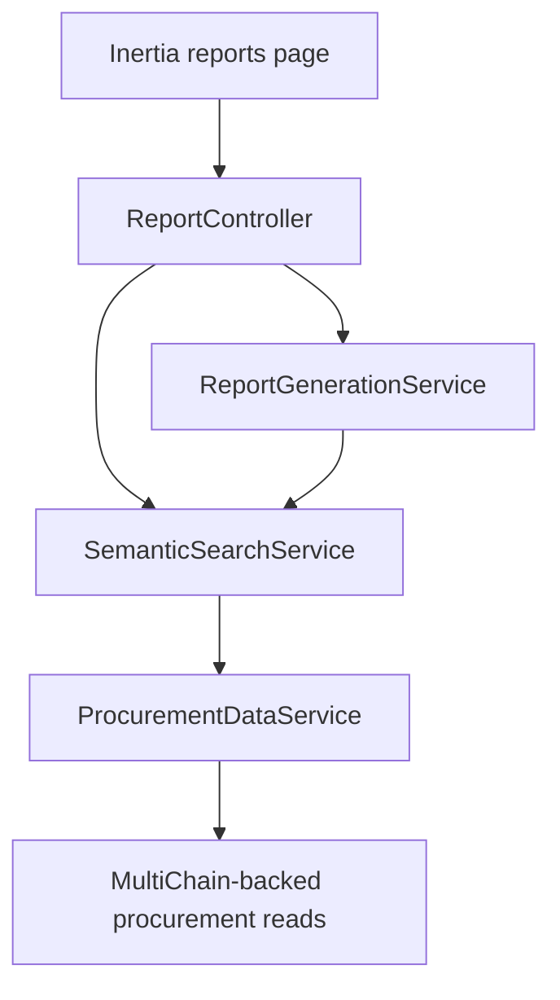

# Reporting and Search Architecture

This document covers the reporting subsystem only.

Important naming note: parts of the codebase and docs still use the label "semantic search", but the current implementation is filtered keyword search over procurement data. It is not vector search and it does not use embeddings.

## Route Surface

- `GET /reports`
- `POST /reports/generate`
- `POST /reports/export`
- `POST /search`

All routes require authentication.

## Main Components

## Responsibilities

### `ReportController`

- renders the reports page
- validates request input
- delegates report generation and export
- delegates search requests

### `ReportGenerationService`

- builds reporting filters
- converts month/quarter/year filters into date ranges
- assembles summary and time-series payloads
- exports report output

### `SemanticSearchService`

- performs filtered keyword matching
- narrows results by status, stage, mode, category, and date range
- calculates summary distributions

### `ProcurementDataService`

- reads procurement-oriented blockchain data
- normalizes it into structures that reporting/search services can filter and summarize

## Data Flow

1. User opens the reports page.
2. The reports page submits filter/search criteria.
3. `ReportController` validates and routes the request.
4. `ReportGenerationService` or `SemanticSearchService` prepares filters.
5. `ProcurementDataService` supplies normalized procurement data.
6. The service returns summary cards, distributions, time-series data, and result rows.
7. The frontend renders the response and allows export.

## Filters

Current reporting/search filters include:

- keyword query
- month
- quarter
- year
- explicit date range
- status
- stage
- procurement mode
- category

## Exports

Current export formats:

- CSV
- JSON

## Operational Constraints

- the quality of search/report output depends on blockchain data availability
- reports are generated on demand
- the "semantic search" name is legacy and should not be interpreted as AI-based retrieval

## Recommended Extension Points

If you extend this subsystem:

- keep request validation in the controller/form request layer
- keep filtering/aggregation in services
- keep blockchain access behind procurement data services/repositories
- preserve route names because the frontend depends on generated Wayfinder helpers
