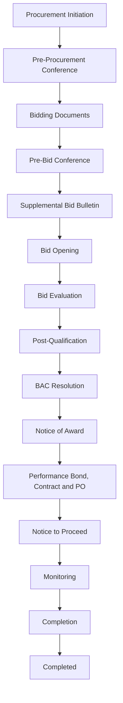

## Procurement Stages (Philippine LGU Context)

- Procurement Initiation
    - Project Procurement Management Plan (PPMP)
    - Annual Procurement Plan (APP)
    - Purchase Request (PR)
    - Sangguniang Bayan Resolution (if required)
- Pre-Procurement Conference
    - Conference Agenda
    - Attendance Sheet
    - Minutes of Meeting
- Bidding Documents
    - Approved Budget for the Contract (ABC)
    - Bidding Documents (as per RA 9184)
    - Invitation to Bid
- Pre-Bid Conference
    - Conference Agenda
    - Attendance Sheet
    - Minutes of Meeting
- Supplemental Bid Bulletin
    - Supplemental/Bid Bulletin
    - Bid Clarifications
- Bid Opening
    - Bid Submission Receipts
    - Abstract of Bids
    - Minutes of Bid Opening
- Bid Evaluation
    - Bid Evaluation Report
    - Detailed Bid Analysis
- Post-Qualification
    - Post-Qualification Report
    - Supporting Documents (e.g., Mayor's Permit, Tax Clearance, etc.)
- BAC Resolution
    - BAC Resolution Recommending Award
    - Notice of Lowest Calculated and Responsive Bid (LCRB)
- Notice of Award
    - Notice of Award
    - Acceptance of Award by Supplier/Contractor
- Performance Bond, Contract and PO
    - Contract Agreement
    - Performance Security/Bond
    - Purchase Order (PO)
    - Sangguniang Bayan Resolution (for contracts requiring approval)
- Notice to Proceed
    - Notice to Proceed
    - Supplier/Contractor Acknowledgment
- Monitoring
    - Inspection and Acceptance Report (IAR)
    - Delivery Receipt
    - Progress/Monitoring Reports
- Completion
    - Certificate of Completion
    - Final Acceptance Report
- Completed
    - Project Completion Report
    - Turnover Documents

---

